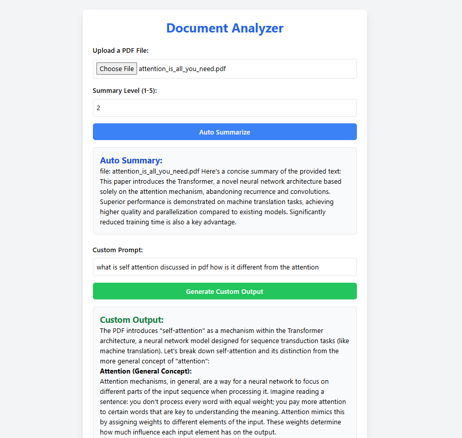

### **README for Document Analyzer App**

---

# **Document Analyzer App**

## **Overview**
The **Document Analyzer App** is a web-based application designed to automatically analyze PDF documents, summarize them, and generate customized outputs based on user-defined prompts. Built with **React.js**, **Vite**, and **Flask** for handling the frontend and backend integration, the app provides an intuitive interface for uploading PDF files, generating summaries, and querying the document for custom outputs.

The app uses **React** for the frontend and **Flask** for the backend to handle requests for document analysis. It supports:
1. **Auto Summarization** – Automatically generates a summary based on a specified summary level.
2. **Custom Output** – Accepts user-defined prompts and returns relevant information from the PDF document.

---

## **Demo View**

### Screenshot 1: Uploading a PDF and Auto Summary Option




## **Features**

1. **PDF Upload**: Upload a PDF file to be analyzed.
2. **Auto Summary**: Generate a summary of the PDF content based on the specified summary level (1-5).
3. **Custom Prompt**: Allow users to provide custom queries to extract specific information from the uploaded PDF.
4. **Error Handling**: User-friendly error messages for file upload issues or missing inputs.
5. **Responsive Design**: The app is built using **Tailwind CSS** to ensure responsiveness across various screen sizes.

---

## **Tech Stack**

- **Frontend**:
  - **React.js** for building the user interface.
  - **Vite** for fast development and build tooling.
  - **Tailwind CSS** for styling the app and responsive design.
  - **Axios** for API requests to interact with the backend.
  - **ReactMarkdown** to render Markdown-formatted content.

- **Backend**:
  - **Flask** for creating API endpoints that handle PDF processing and generate summaries or custom outputs.
  - **Python libraries** (e.g., **PyMuPDF**, **Pandas**, **NLTK**) for extracting and processing PDF content.

---

## **Installation & Setup**

### **1. Clone the repository:**

```bash
git clone <repository-url>
cd <project-directory>
```

### **2. Frontend Setup (React + Vite)**

#### Install dependencies:
First, install **Node.js** (if not installed already), then install the frontend dependencies:

```bash
cd frontend
npm install
```

#### Start the frontend:
```bash
npm run dev
```

The React app should now be running locally at **http://localhost:3000**.

### **3. Backend Setup (Flask)**

#### Install dependencies:
First, make sure **Python 3.x** is installed, then create a virtual environment and install the backend dependencies:

```bash
cd backend
python -m venv venv
source venv/bin/activate  # On Windows use `venv\Scripts\activate`
pip install -r requirements.txt
```

#### Start the Flask backend:
```bash
python app.py
```

The Flask backend will be running on **http://localhost:5000**.

---

## **Usage**

1. **Upload a PDF file**: 
    - Click the file input to upload a PDF document from your local system.

2. **Auto Summarization**:
    - Enter a **Summary Level** (1-5):
      - **1**: Brief summary.
      - **5**: Detailed summary.
    - Click **Auto Summarize** to generate a summary of the document.

3. **Custom Prompt**:
    - Enter a custom query (e.g., "What are the main findings of the study?").
    - Click **Generate Custom Output** to get relevant information based on the document content.

4. **View Results**: 
    - View the generated auto summary and/or the custom output on the page.

---


## **Backend API Endpoints**

### **POST** `/api/autosummarize`
- **Request body**:
    - `uploaded_file` (PDF file)
    - `summary_level` (integer, 1-5)
- **Response**:
    - `auto_summary` (string) – the auto-generated summary of the document.

### **POST** `/api/customprompt`
- **Request body**:
    - `uploaded_file` (PDF file)
    - `prompt` (string) – user-defined query.
- **Response**:
    - `output` (string) – output generated based on the prompt.

---
