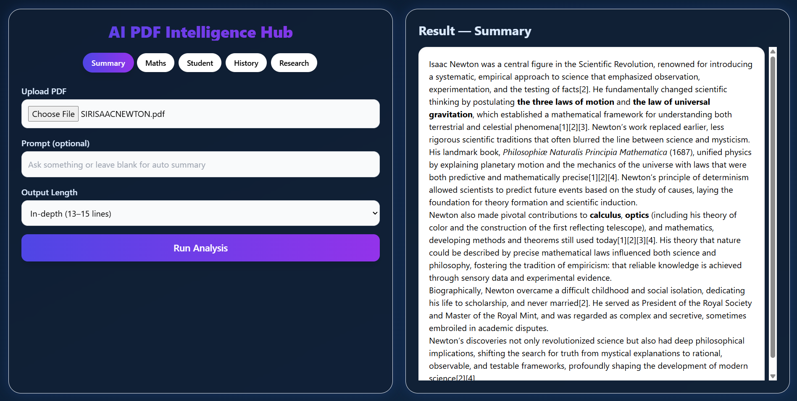
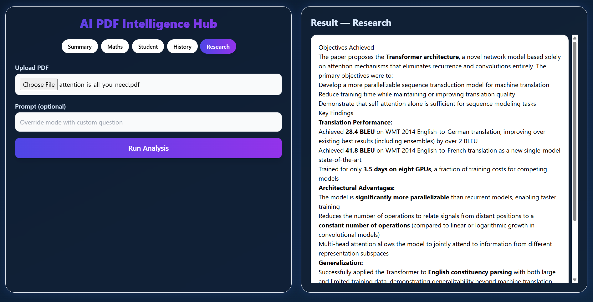

# 📄 AI PDF Intelligence Hub

**Advanced RAG-based PDF Understanding System using LangChain, Vector DB & Perplexity LLM**

A full-stack AI system that converts any PDF into **actionable insights** using **Retrieval-Augmented Generation (RAG)**.
The application supports smart summarization, mathematical formula extraction, history timelines, student notes, research insights, and custom prompts.

Built with:

* **LangChain** for orchestration
* **Perplexity Sonar Pro LLM** for reasoning
* **ChromaDB** Vector Store for semantic retrieval
* **Flask** backend for document ingestion + RAG pipeline
* **React + Tailwind CSS** for a clean, modern, glassmorphic UI
* **PDF parsing & chunking** with custom loaders

---

# 📸 Sample Screenshots

### **Summary Mode**



### **Research Mode**



---

# 🚀 Features

### 🔎 1. AI-Powered PDF Analysis

Upload any PDF and ask the AI to:

* Generate summaries (short → in-depth)
* Extract mathematical equations & formulas
* Generate student-friendly topic breakdowns
* Extract historical timelines
* Extract research objectives & conclusions
* Provide answers using **RAG-based QA**

---

### 🧠 2. Retrieval-Augmented Generation (RAG)

* Extract & chunk PDF text
* Embed using chosen embedding provider
* Store in **ChromaDB** vector store
* Query through LangChain RetrievalQA
* Perplexity LLM produces precise, source-aware answers

---

### 📚 3. Document Ingestion Pipeline

When a PDF is ingested, the system:

1. Extracts text
2. Splits content into clean semantic chunks
3. Embeds chunks
4. Builds or updates the local vector database
5. Wires it into the RAG chain for future queries

---

### 🎨 4. Modern Professional UI

Built using **React + Tailwind CSS** with:

* Dark-blue futuristic theme
* Hover animations
* Split view (left = controls, right = results)
* Scrollable output container
* Markdown rendering & formatting

---

# 🏗️ Tech Stack

### **Backend**

| Component      | Technology                              |
| -------------- | --------------------------------------- |
| Language       | Python                                  |
| Framework      | Flask                                   |
| LLM            | Perplexity Sonar Pro (`ChatPerplexity`) |
| RAG Framework  | LangChain                               |
| Vector Store   | ChromaDB                                |
| Embeddings     | Custom provider (configurable)          |
| PDF Processing | PyPDF2 / pdfminer                       |

---

### **Frontend**

| Component    | Technology                            |
| ------------ | ------------------------------------- |
| UI Framework | React + Vite                          |
| Styling      | Tailwind CSS (Custom dark-blue theme) |
| Rendering    | React Markdown                        |
| Networking   | Axios                                 |

---

# 📦 Project Structure

```
📂 backend/
 ├── app.py                 # Flask server routes
 ├── loader.py              # PDF extraction & chunking
 ├── rag_chain.py           # LangChain RAG pipeline
 ├── embeddings_store.py    # Embeddings + Chroma setup
 ├── prompts.py             # Dynamic prompt templates
 ├── .env                   # API Keys

📂 frontend/
 ├── src/App.jsx            # Full UI with split panels
 ├── components/...
 ├── styles/global.css
 ├── vite.config.js
```

---

# 🔧 API Endpoints

### **POST /api/summarize**

Handles PDF upload + summarization / mode-based extraction
Supports:

* summary
* maths
* history
* student
* research
* custom prompt override

---

### **POST /api/ingest**

Indexes a PDF into ChromaDB for RAG queries.

---

### **POST /api/qa**

Query the indexed document using RetrievalQA.

---

# 🧩 How the RAG Flow Works

```
      PDF Upload
           ↓
   Text Extraction (loader.py)
           ↓
   Chunking (semantic splits)
           ↓
   Embedding Generation
           ↓
   Chroma Vector Store
           ↓
   Retrieval via LangChain
           ↓
   Perplexity LLM (Sonar Pro)
           ↓
   Final AI Response
```

---

# 📱 Frontend UI Features

* Left side: PDF upload + prompt + controls
* Right side: Scrollable output panel
* Glassblur + gradients + neon hover effects
* Markdown rendering for equations & structured output
* Instant mode switching

---

# ⚙️ Environment Setup

### **Backend Setup**

```bash
cd backend
pip install -r requirements.txt
python app.py
```

Your `.env` file must contain:

```
PERPLEXITY_API_KEY=your_key_here
```

---

### **Frontend Setup**

```bash
cd frontend
npm install
npm run dev
```

---

# 🌟 Why This Project Is Resume-Worthy

This project demonstrates:

✔ Mastery of LangChain pipelines
✔ Ability to implement Retrieval-Augmented Generation
✔ Experience with Vector DBs (ChromaDB)
✔ Custom prompts, summarization modes & logic
✔ Integration of Perplexity commercial-grade LLM
✔ Strong frontend/UI engineering
✔ Complete end-to-end AI application design

Perfect for **AI Engineer**, **ML Engineer**, **Gen-AI**, **Full-Stack AI**, or **Research Engineer** roles.
